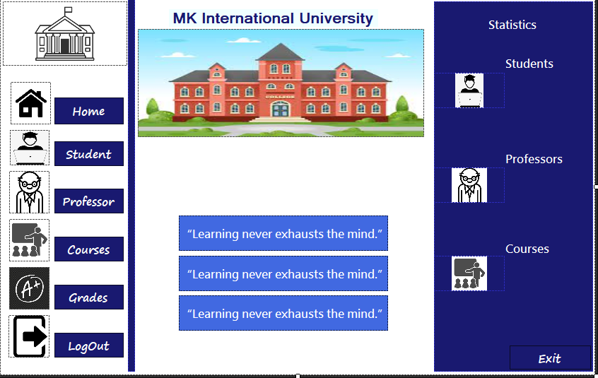
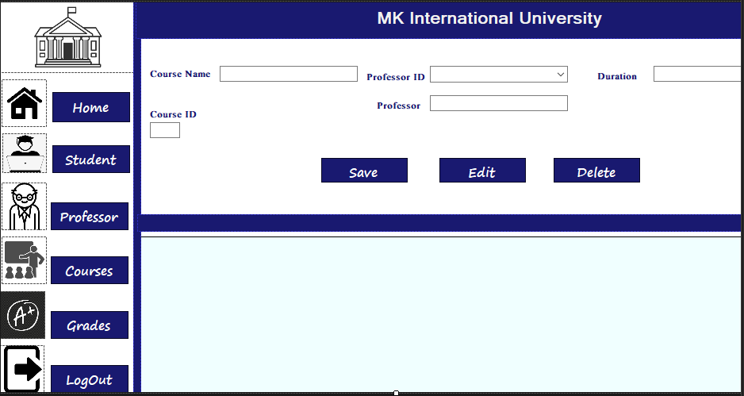

<b>University Management System</b>  
A C# application designed for both users and admins to efficiently manage university data. Users can add, update, and delete information, ensuring an organized and accessible database for academic institutions. Admins have enhanced control to oversee and maintain the integrity of the data.  
  

